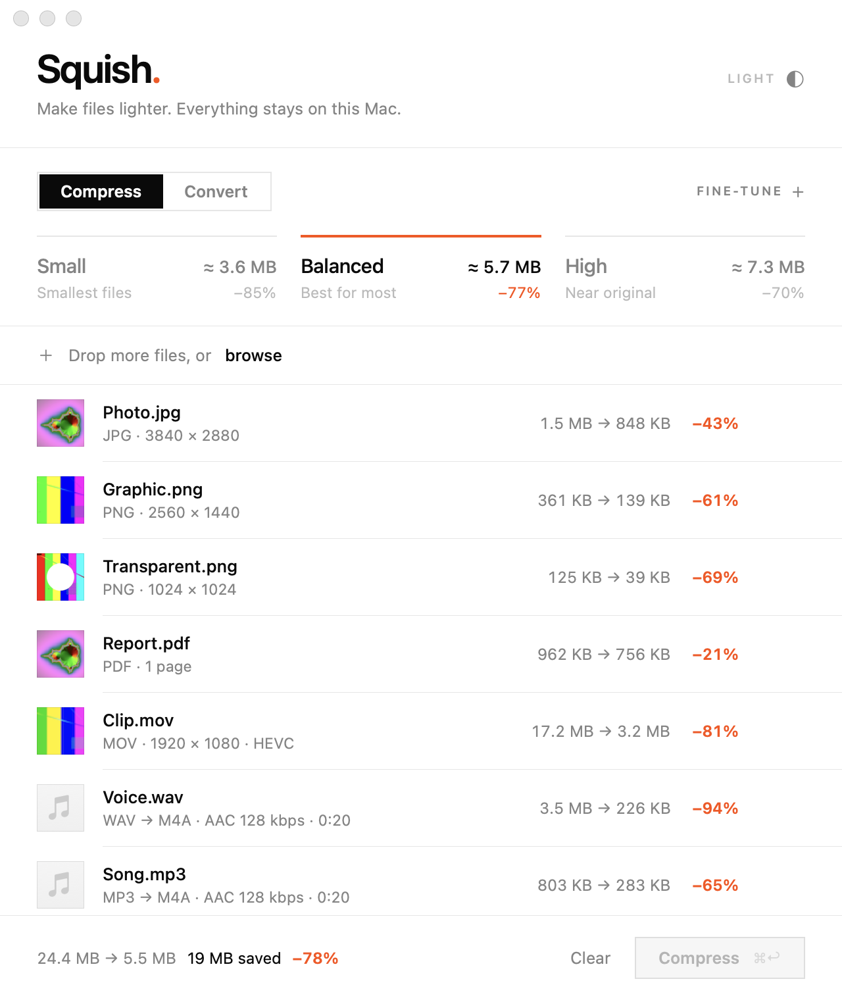
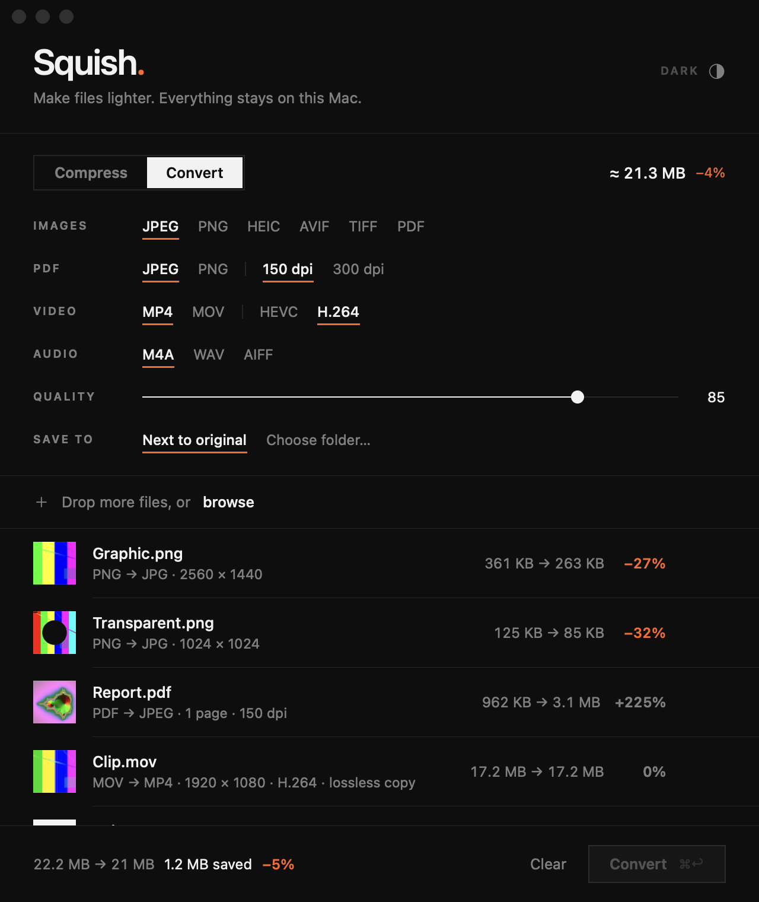
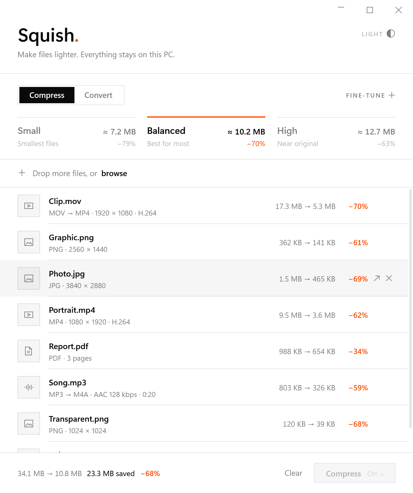
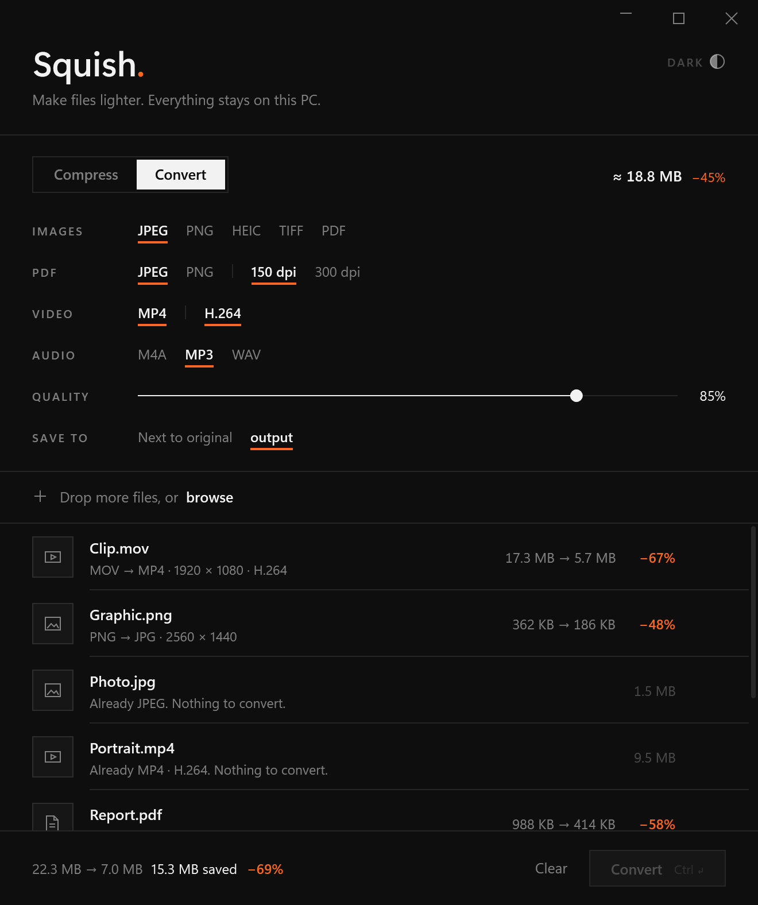

# Squish.

A small, minimal app for compressing and converting images, PDFs, video and audio, available for **macOS** and **Windows**. Everything happens on your computer: no uploads, no accounts, no network.

<p align="center">
  
  &nbsp;
  
</p>
<p align="center"><sub>macOS</sub></p>

<p align="center">
  
  &nbsp;
  
</p>
<p align="center"><sub>Windows. These screenshots come from the automated test run, on a machine without thumbnail handlers, so files show line glyphs; a normal PC shows real thumbnails.</sub></p>

## What it does

**Compress** makes files smaller while keeping each one's format (audio becomes AAC).

- Pick **Small**, **Balanced** or **High**. Each preset shows the predicted total size of your queue before you start.
- **Fine-tune** sets quality, maximum size, the video codec, metadata, and where to save.

**Convert** changes file types:

| From | To |
|---|---|
| Images | JPEG, PNG, HEIC, AVIF\*, TIFF, or PDF (one per image, or all combined into one) |
| PDF | JPEG or PNG images of every page, at 150 or 300 DPI |
| Video | MP4 (or MOV\*) in H.264 or HEVC |
| Audio | M4A, WAV, and AIFF\* or MP3\*\* |

\* macOS only  \*\* Windows only

**Also:**

- Drop files or whole folders onto the window.
- Originals are never modified.
- Files that can't be made smaller, or that are already in the target format, are left alone.
- Lossy PNG uses a built-in palette quantizer, similar to pngquant.
- Video uses the hardware encoders, with HDR and rotation preserved on macOS.
- On macOS, tracks already in the target codec are copied losslessly.

## Download

Builds from the latest commit are attached to each [Actions run](../../actions):

- **macOS:** `Squish-macOS` (universal, macOS 14 or later)
- **Windows:** `Squish-windows-x64` and `Squish-windows-arm64` (Windows 10 1809 or later, needs the [.NET 10 Desktop Runtime](https://dotnet.microsoft.com/download/dotnet/10.0))

Tagged versions (`v1.0.0` and so on) are published as [Releases](../../releases) by `.github/workflows/release.yml`. These include a standalone Windows build that doesn't need the runtime.

Neither app is signed with a paid developer certificate. The first time you open Squish, macOS needs a right-click → **Open**, and Windows SmartScreen needs **More info → Run anyway**.

## Repository

| Folder | |
|---|---|
| [`apple/`](apple) | macOS app: SwiftUI, ImageIO, PDFKit/Quartz, AVFoundation. About 1.7 MB. See [apple/README.md](apple/README.md). |
| [`windows/`](windows) | Windows app: WPF on .NET 10, WIC, Windows.Data.Pdf, Media Foundation, PDFsharp. See [windows/README.md](windows/README.md). |
| [`.github/workflows/`](.github/workflows) | CI that builds both apps. On Windows it also runs the real app through every mode on generated files and saves screenshots and outputs for review. |

Both apps share one design: monochrome hairlines, a single orange accent, the same presets, the same bitrate plans, and the same size-prediction approach. Each uses its own platform's native media frameworks rather than bundling codecs, which is what keeps them small.

### Build from source

```bash
# macOS (Xcode or the Command Line Tools)
cd apple && ./scripts/build.sh            # → apple/build/Squish.app
```

```bash
# Windows (.NET 10 SDK)
cd windows && dotnet publish Squish/Squish.csproj -c Release -r win-x64 --self-contained false -p:PublishSingleFile=true -o publish
```
